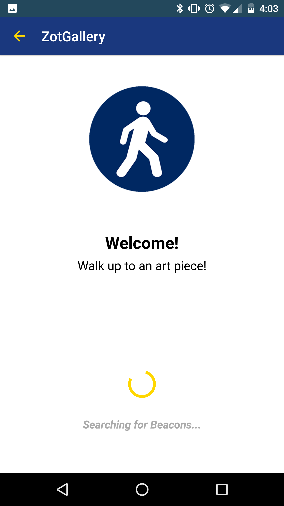
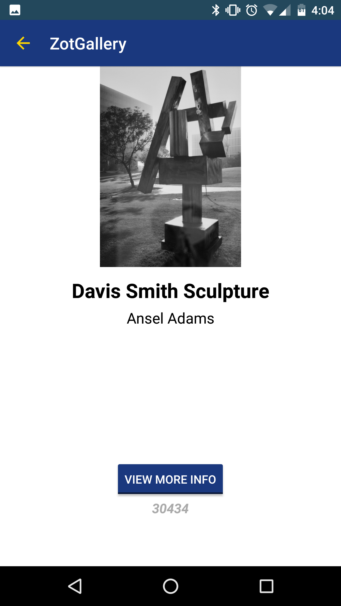

# UCI Student Center Art Gallery
###Description
An Android app that detects nearby Estimote Beacons and displays different information accordingly for each Beacon.
This app is used for the UCI Student Center Art Galleries as a proof-of-concept of the usage of Beacons for indoor proximity detection.

Application serves as an art gallery guide for users. The app accesses an online server-hosted database, which associates physical beacons with individual art pieces and their information. Each beacon is associated with an art piece, physically located in an art gallery in the student center. 

###Features
- Detects all beacons associated with one UUID (UCI Student Center art gallery beacons)

- Finds the nearest beacon (an art piece that the user walks up to) and obtains information regarding that art piece from an online database stored on a server.

- When a user wishes to read more information about the currently detected art piece, they press a "View More Info" button that "locks" the app to that specific art piece. The app then displays more information regarding the piece.

- On start, app connects to the UCI Art Gallery database and stores information for all the part pieces locally

- For the nearest beacon detected, app attempts to match the detected beacon to its associated artpiece from the database. If one is found, information for that piece is displayed on screen, and associated image downloaded and displayed. Else, if the detected beacon does not have an associated art piece in the database, the major ID is displayed only.

###Screenshots

